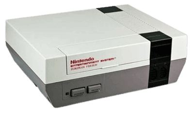

# NES AI



NES AI is a Proof of Concept that implements an inference engine for Neural Networks (Multi Layer Perceptron, MLP)
capable of running on the 8 bit Nintendo Entertainment System (NES) console.

> Neural Network Inference on Nintendo Entertainment System (NES)

This project demonstrates how machine learning calculations can be performed on a processor based on the MOS 6502
(`1.79 MHz`) with only `2KB` of RAM, using fixed point math and aggressive memory optimization.

## Model architecture
The model is a Feed Forward Neural Network trained on the `MNIST` dataset (handwritten digits), resized to a 7x7 pixel grid.
- Input: `49` neurons (normalized `7x7` image)
- Hidden Layer 1: `49` neurons (Activation: `ReLU`)
- Hidden Layer 2: `24` neurons (Activation: `ReLU`)
- Output Layer: `10` neurons (Activation: `Stable Softmax`)
- Weights: `3,900` parameters

## Technical details
- Languages: C (compiled with cc65 and following its non-standard conventions) and Assembly 6502
- Math: Fixed-point math `Q16.16` via the `libfixmath` library (optimized for 8 bit, no uint64_t support required)
- Custom `nes.cfg` linker script: configured for the simplest NES mapper, NROM (32KB PRG/Program, 8KB CHR/Sprites)
- Memory:
  - Weights: Stored as constants in the `PRG-ROM` (Read-Only Memory) to avoid consuming the limited RAM
  - Stack: Minimal usage (it's only `256 bytes`!)
  - Inference uses static buffers allocated in `BSS`/`RAM`, no dynamic allocation (`malloc`) because NES doesn't have a heap

## Training
To train the model, I have used Tensorflow/Keras in a Python script that automatically generates C files for the project
(`weights.c`, `weights.h`), containing the model weights converted to the `fix16_t` format (`libfixmath`), in hexadecimal
(e.g. `0xFFFFDF99` represents `-0.126572`), so that they can be used directly.

> **[Read more](https://github.com/ErikPelli/nes-ai/tree/master/training)**

## I/O
### Input
To provide the image to be recognized as input, you must change the value of the `_data_input` variable in `cli/main.c`.
```c
static fix16_t _data_input[MLP_INPUT_SIDE][MLP_INPUT_SIDE] = {
    {0, 0, 0, 0, 0, 0, 0},
    {0, 0, 0, 10, 0, 0, 0},
    {0, 0, 10, 10, 0, 0, 0},
    {0, 0, 0, 10, 0, 0, 0},
    {0, 0, 0, 10, 0, 0, 0},
    {0, 0, 0, 10, 0, 0, 0},
    {0, 0, 0, 0, 0, 0, 0},
};
```

The range of accepted values is `[0, 10]`, where the closer the value is to `10`, the closer the color drawn is to white.
In the training dataset, the background was black and the digit was white, so you should use a number close to `10` for
the digit and a number close to `0` for the background.

### Output
The NES will print a text on the screen with the results of the analysis:
```
NES AI
0: 0%
1: 87%
2: 0%
3: 1%
4: 0%
5: 1%
6: 0%
7: 0%
8: 11%
9: 0%
```

It worked! The model correctly recognized that our input was `1`.
Now try it yourself.

## Build the project
### Requirements
- cc65 compiler (tested with v2.18)
- cmake (>= 3.20)

### Build
```shell
mkdir build
cd build
cmake ..
make
```

This will create a file called `nes-ai-cli.nes` in the project folder, which you can run directly on a physical NES
console (or on an emulator).
